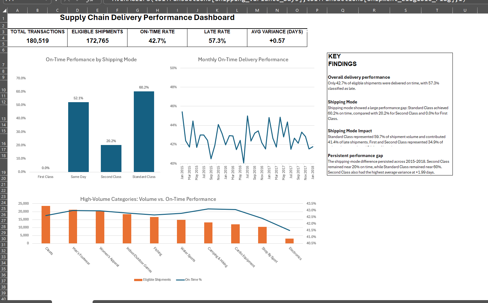

# Supply Chain Delivery Performance Analysis

Excel-based analysis of 180,519 historical shipment transactions to evaluate delivery performance across shipping modes, product categories, and time periods.

## Project Overview

This project analyzes historical shipment data to identify where delivery-performance issues are concentrated and evaluate the relationship between shipping mode, shipment volume, product category, and on-time delivery.

The analysis was designed as a supply chain performance investigation rather than a simple reporting exercise. The objective was to establish a baseline, identify meaningful performance differences, and determine where further operational investigation should be focused.

## Business Questions

* What is the overall on-time delivery performance?
* Which shipping modes show the largest performance differences?
* Are late shipments concentrated in particular shipping modes or categories?
* Does the shipping-mode performance gap persist over time?
* Are high-volume categories performing materially differently from the overall business?

## Tools & Techniques
Excel: Power Query, PivotTables, PivotCharts, XLOOKUP, calculated fields, helper columns
Analysis: KPI development, on-time delivery analysis, shipping variance, volume/contribution analysis

## Dashboard

## Key Findings

### Overall Delivery Performance

* **172,765** shipments were eligible for delivery-performance analysis.
* **42.7%** of eligible shipments were delivered on time.
* **57.3%** were late.
* Average shipping variance was **+0.57 days**.

### Shipping Mode Performance

Shipping mode showed the largest observed performance difference in the analysis:

| Shipping Mode  | On-Time Rate | Eligible Volume | Late Contribution | Avg. Variance |
| -------------- | -----------: | --------------: | ----------------: | ------------: |
| Standard Class |        60.2% |           59.7% |             41.4% |    -0.01 days |
| Same Day       |        52.1% |            5.4% |              4.5% |    +0.48 days |
| Second Class   |        20.2% |           19.6% |             27.3% |    +1.99 days |
| First Class    |         0.0% |           15.4% |             26.8% |    +1.00 days |

First and Second Class shipments represented **34.9% of eligible volume but 54.1% of late shipments**, indicating that these shipping modes contributed a disproportionate share of observed late deliveries.

### Persistent Performance Gap

The shipping-mode performance gap remained visible across the 2015–2018 analysis period. Second Class remained near **20% on-time performance**, while Standard Class remained near **60%**.

Second Class also recorded the highest average shipping variance at approximately **+1.99 days**.

### Category Analysis

The highest-volume categories accounted for a large share of late shipments, but their individual on-time rates generally remained close to the overall business rate.

This suggests that category concentration was primarily **volume-driven**, while the largest observed performance differences were associated with shipping mode.

## Methodology

The analysis was structured around the following process:

1. Clean and prepare historical shipment transaction data using Power Query and Excel.
2. Define shipment eligibility for delivery-performance analysis.
3. Create analytical flags for on-time and late shipments.
4. Calculate shipping variance using actual versus scheduled shipping time.
5. Aggregate results using PivotTables and supporting calculations.
6. Compare performance across shipping modes, categories, and time periods.
7. Build a dashboard to communicate the most important operational findings.

## Project Structure

* `Supply_Chain_Delivery_Performance_Portfolio.xlsx` — completed portfolio workbook containing the dashboard, supporting analysis, and project documentation.
* `dashboard.png` — dashboard preview.
* `Project_Documentation` — methodology, metrics, findings, and interpretation within the workbook.

## Interpretation

The analysis identifies **shipping mode as a strong observed relationship with delivery performance**, particularly the persistent difference between Standard and Second Class shipments.

The results should be interpreted as an analytical association rather than proof that shipping mode alone causes late delivery. Additional operational investigation would be required to evaluate potential contributing factors such as carrier performance, routing, fulfillment timing, service-level assumptions, and order characteristics.

## Data Disclaimer

The portfolio version of the workbook does not include the underlying transaction-level dataset. The published workbook contains the completed analytical outputs, dashboard, supporting analysis, and documentation while excluding the original transaction records.

This project is intended to demonstrate supply chain analytics, Excel modeling, data preparation, and business interpretation skills.
